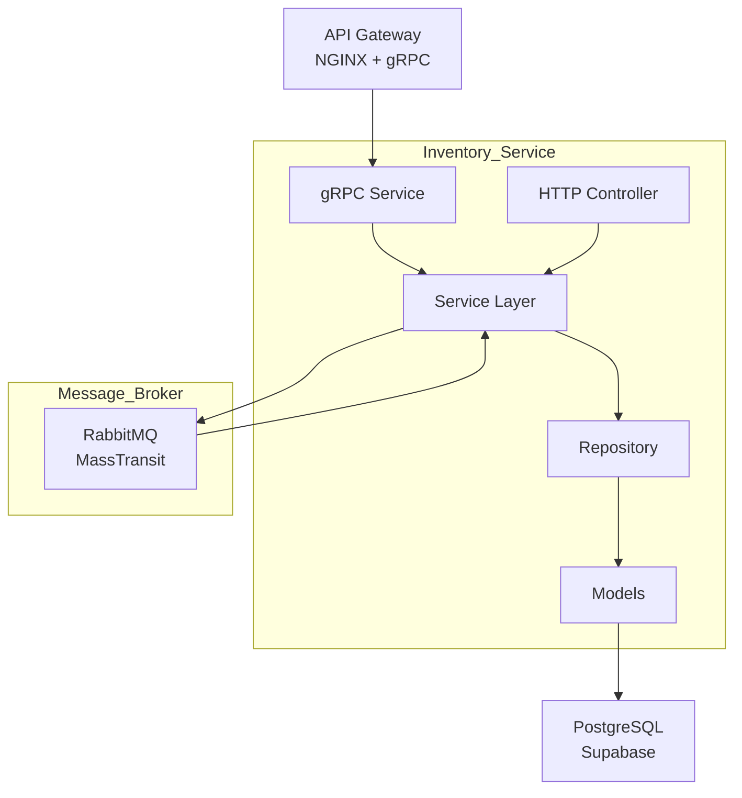

# Censudex - Inventory Service

Sistema de gestión de inventario para la plataforma de retail Censudex. Este servicio forma parte de la arquitectura de microservicios, especializado en la administración de stock, alertas de bajo inventario y sincronización con el sistema de pedidos mediante RabbitMQ.

## Arquitectura y Patrón de Diseño

### Arquitectura: Microservicios con Event-Driven

El Inventory Service implementa una arquitectura de capas (Layered Architecture) con patrón Repository y comunicación asíncrona mediante eventos.



### Patrones de Diseño Implementados:

1. **Repository Pattern:** Abstracción del acceso a datos
2. **Dependency Injection:** Inyección de dependencias
3. **Data Transfer Object (DTO):** Transferencia de datos entre capas
5. **Event-Driven Pattern:** Comunicación asíncrona con RabbitMQ
6. **Consumer Pattern:** Procesamiento de mensajes asíncronos

## Tecnologías Utilizadas

- **Framework:** ASP.NET Core 9.0
- **Base de Datos:** PostgreSQL (Supabase)
- **ORM:** Entity Framework Core
- **Comunicación Síncrona:** gRPC
- **Message Broker:** RabbitMQ con MassTransit
- **Control de Versiones:** Git con Conventional Commits

## Modelo de Datos

### Entidad Inventory (PostgreSQL Table)

```
{
  "ProductId": "UUID v4",
  "ProductName": "string(100)",
  "ProductCategory": "string(100)",
  "StockQuantity": "integer",
  "ThresholdLimit": "integer",
  "ProductStatus": "string(100)"
  "CreatedAt": "DateTime"
  "UpdateAt": "DateTime"
  "DeletedAt": "DateTime"
}
```
### Estados de Producto:

- **true (activo):** Producto disponible en inventario
- **false (inactivo):** Producto dado de baja (soft delete)

## Endpoints de la API

### gRPC Service (Puerto 5001)

| Método | Descripción | Request | Response |
|--------|-------------|---------|----------|
| `GetAllInventoryItems` | Listar inventario | GetAllInventoryItemsRequest | GetAllInventoryItemsResponse |
| `GetInventoryItemById` | Obtener por ID | GetInventoryItemByIdRequest | GetInventoryItemByIdResponse |
| `UpdateInventoryItemStock` | Actualizar stock | UpdateInventoryItemStockRequest | UpdateInventoryItemStockResponse |

### Eventos RabbitMQ

| Tipo | Evento | Exchange | Routing Key | Descripción |
|------|--------|----------|-------------|-------------|
| **Publica** | `StockAlertMessage` | `inventory_events` | `stock.low` | Alerta de bajo stock |
| **Publica** | `OrderFailedStockMessage` | `order_events` | `order.failed.stock` | Orden rechazada por stock |
| **Consume** | `OrderCreatedMessage` | `order_events` | `order.created` | Procesa nueva orden |

## Instalación y Configuración

### Requisitos Previos

- **.NET 9 SDK**: [Download](https://dotnet.microsoft.com/download/dotnet/9.0)
- **Docker Desktop**: [Download](https://www.docker.com/products/docker-desktop)
- **Cuenta Supabase**: [Crear cuenta](https://supabase.com)
- **Visual Studio Code**: [Download](https://code.visualstudio.com/)

### 1. Clonar el Repositorio
```bash
git clone https://github.com/Censudex/censudex-inventory-service.git
cd censudex-inventory-service
cd InventoryService
```

### 2. Configurar Variables de Entorno

Crea un archivo **.env** en la raíz del proyecto:
```env
# PostgreSQL (Supabase) - Session Pooler
SUPABASE_HOST=aws-1-us-east-2.pooler.supabase.com
SUPABASE_DATABASE=postgres
SUPABASE_USERNAME=postgres.wrtvfjpsowhggmgwedpq
SUPABASE_PASSWORD=Jvallec@06
SUPABASE_PORT=5432

# RabbitMQ
RABBITMQ_HOST=localhost
RABBITMQ_USERNAME=guest
RABBITMQ_PASSWORD=guest
```

**Nota importante:** 
- Obtén tus credenciales de Supabase en: **Settings → Database → Connection string → Session pooler**
- Si tu contraseña contiene `@`, escápalo como `%40` en el connection string

### 3. Instalar Dependencias
```bash
dotnet restore
```

### 4. Iniciar RabbitMQ con Docker
```bash
# Crear y ejecutar RabbitMQ con administración habilitada
docker run -d --name rabbitmq -p 5672:5672 -p 15672:15672 rabbitmq:3-management

# Si el contenedor ya había sido creado anteriormente,
# simplemente iniciarlo nuevamente:
docker start rabbitmq
```

Accede a la interfaz web: http://localhost:15672 (usuario: `guest`, password: `guest`)


### 5. Aplicar Migraciones a la Base de Datos

```bash
# Crear migración inicial (si no existe)
dotnet ef migrations add InitialCreate

dotnet ef database update
```

Esto creará la tabla `inventory` en PostgreSQL (Supabase).

### 6. Compilar el Proyecto
```bash
dotnet build
```

### 7. Ejecutar el Proyecto
```bash
dotnet run
```

El servicio estará disponible en:
- **HTTP REST:** http://localhost:5110 (solo para testing de RabbitMQ)
- **gRPC:** http://localhost:5001 (endpoints principales)

## Ejemplos de Uso

### gRPC (Producción - Puerto 5001)

Los siguientes servicios están disponibles vía gRPC para comunicación con el API Gateway:

#### 1. GetAllInventoryItems

**Servicio:** `inventory.InventoryService/GetAllInventoryItems`

**Request:**
```json
{}
```

**Response:**
```json
{
  "items": [
    {
      "product_id": "a1b2c3d4-e5f6-4a5b-8c9d-0e1f2a3b4c5d",
      "product_name": "Laptop HP",
      "product_category": "Electrónica",
      "product_stock": 50
    }
  ]
}
```

#### 2. GetInventoryItemById

**Servicio:** `inventory.InventoryService/GetInventoryItemById`

**Request:**
```json
{
  "Item_id": "a1b2c3d4-e5f6-4a5b-8c9d-0e1f2a3b4c5d"
}
```

**Response:**
```json
{
  "Item": {
    "product_id": "a1b2c3d4-e5f6-4a5b-8c9d-0e1f2a3b4c5d",
    "product_name": "Laptop HP",
    "product_category": "Electrónica",
    "product_stock": 50
  }
}
```

#### 3. UpdateInventoryItemStock

**Servicio:** `inventory.InventoryService/UpdateInventoryItemStock`

**Request (Decrementar):**
```json
{
  "Item_id": "a1b2c3d4-e5f6-4a5b-8c9d-0e1f2a3b4c5d",
  "Operation": "decrease",
  "Quantity": 5
}
```

**Request (Incrementar):**
```json
{
  "Item_id": "a1b2c3d4-e5f6-4a5b-8c9d-0e1f2a3b4c5d",
  "Operation": "increase",
  "Quantity": 10
}
```

**Response:**
```json
{
  "Item": {
    "success": true,
    "message": "Stock updated successfully.",
    "product_id": "a1b2c3d4-e5f6-4a5b-8c9d-0e1f2a3b4c5d",
    "product_name": "Laptop HP",
    "product_category": "Electrónica",
    "previous_stock": 50,
    "updated_stock": 45,
    "operation": "decrease",
    "quantity_changed": 5,
    "alert": ""
  }
}
```

**Response con Alerta:**
```json
{
  "Item": {
    "success": true,
    "message": "Stock updated successfully.",
    "product_id": "a1b2c3d4-e5f6-4a5b-8c9d-0e1f2a3b4c5d",
    "product_name": "Laptop HP",
    "product_category": "Electrónica",
    "previous_stock": 12,
    "updated_stock": 8,
    "operation": "decrease",
    "quantity_changed": 4,
    "alert": "Stock below minimum threshold."
  }
}
```

### Probar gRPC con Postman

1. En Postman, selecciona **New → gRPC Request**
2. URL del servidor: `localhost:5001`
3. Importa el archivo `Protos/inventory.proto`
4. Selecciona el método deseado
5. Ingresa el JSON del request
6. Click en **Invoke**

### HTTP REST (Solo para Testing - Puerto 5110)

**Nota:** Los endpoints HTTP están disponibles únicamente para desarrollo y pruebas.

#### Endpoints de Testing RabbitMQ:

**Simular orden creada:**
```bash
curl -X POST http://localhost:5110/api/inventory/test/simulate-order
```

**Simular orden con stock insuficiente:**
```bash
curl -X POST http://localhost:5110/api/inventory/test/simulate-order-fail
```

### Respuesta de Actualización de Stock:
```json
{
  "success": true,
  "message": "Stock updated successfully.",
  "productId": "a1b2c3d4-e5f6-4a5b-8c9d-0e1f2a3b4c5d",
  "productName": "Laptop HP",
  "productCategory": "Electrónica",
  "previousStock": 50,
  "updatedStock": 45,
  "operation": "decrease",
  "quantityChanged": 5,
  "alert": null
}
```

### Respuesta con Alerta de Bajo Stock:
```json
{
  "success": true,
  "message": "Stock updated successfully.",
  "productId": "a1b2c3d4-e5f6-4a5b-8c9d-0e1f2a3b4c5d",
  "productName": "Laptop HP",
  "productCategory": "Electrónica",
  "previousStock": 12,
  "updatedStock": 8,
  "operation": "decrease",
  "quantityChanged": 4,
  "alert": "Stock below minimum threshold."
}
```

## Mensajes RabbitMQ

### 1. StockAlertMessage (Publicado)

**Exchange:** `inventory_events`  
**Routing Key:** `stock.low`
```json
{
  "sender": "InventoryService",
  "productId": "a1b2c3d4-e5f6-4a5b-8c9d-0e1f2a3b4c5d",
  "productName": "Laptop HP",
  "productCategory": "Electrónica",
  "currentStock": 8,
  "thresholdLimit": 10,
  "text": "Alert: Stock for product 'Laptop HP' is below the threshold limit. Current stock: 8.",
  "timestamp": "2024-10-24T10:30:00Z"
}
```

### 2. OrderCreatedMessage (Consumido)

**Queue:** `inventory-order-queue`  
**Exchange:** `order_events`  
**Routing Key:** `order.created`
```json
{
  "orderId": "b2c3d4e5-f6a7-5b6c-9d0e-1f2a3b4c5d6e",
  "customerId": "c3d4e5f6-a7b8-6c7d-0e1f-2a3b4c5d6e7f",
  "items": [
    {
      "productId": "a1b2c3d4-e5f6-4a5b-8c9d-0e1f2a3b4c5d",
      "quantity": 2
    }
  ],
  "createdAt": "2024-10-24T10:25:00Z"
}
```

### 3. OrderFailedStockMessage (Publicado)

**Exchange:** `order_events`  
**Routing Key:** `order.failed.stock`
```json
{
  "orderId": "b2c3d4e5-f6a7-5b6c-9d0e-1f2a3b4c5d6e",
  "reason": "Insufficient stock for one or more products",
  "failedProducts": [
    {
      "productId": "a1b2c3d4-e5f6-4a5b-8c9d-0e1f2a3b4c5d",
      "productName": "Laptop HP",
      "requestedQuantity": 10,
      "availableStock": 5
    }
  ],
  "failedAt": "2024-10-24T10:30:00Z"
}
```

## Pruebas

### 1. Verificar RabbitMQ

Accede a: http://localhost:15672
- **Username:** guest
- **Password:** guest

Ve a **Queues** y verifica que `inventory-order-queue` se cree automáticamente.
